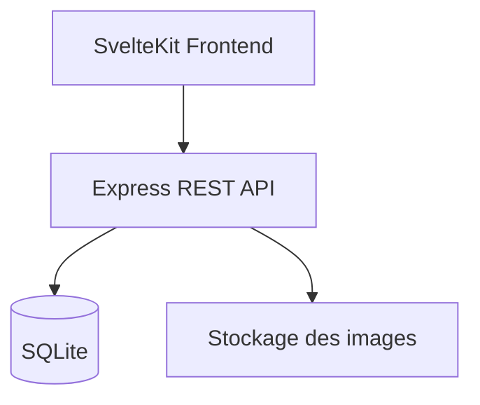
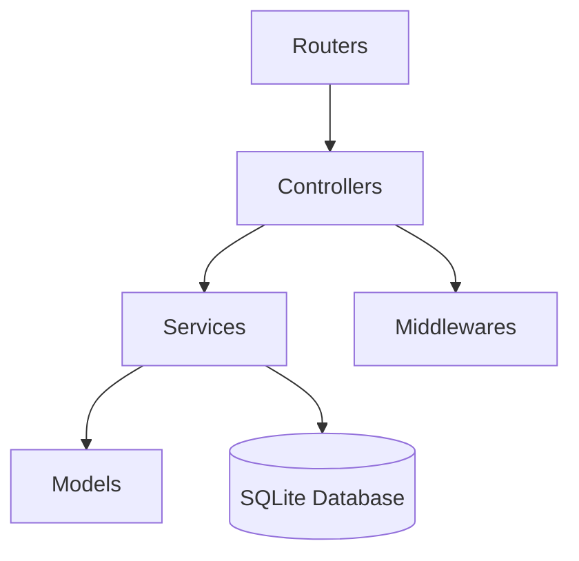
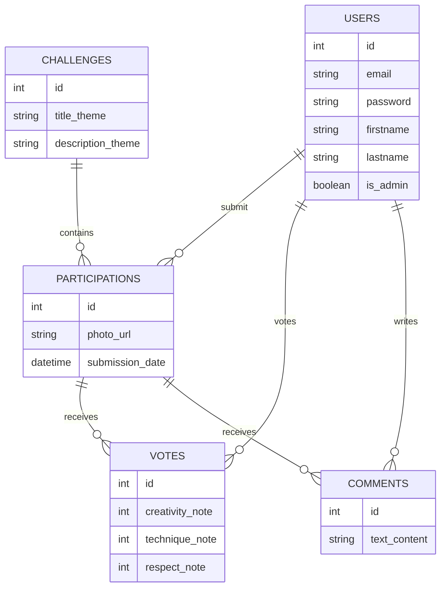

# Le projet

Projet réalisé dans le cadre de l'épreuve E6 du BTS SIO 2026 - Option SLAM.

Ce projet consiste en la conception d'une plateforme web pour l'entreprise fictive FrameLab, spécialisée dans la vente de matériel photographique haut de gamme et l'organisation d'événements destinés aux passionnés de photographie.

Dans le cadre de sa stratégie de fidélisation et de développement communautaire, l'entreprise souhaitait mettre en place une plateforme permettant d'organiser des challenges photo hebdomadaires.

Le principe du projet repose sur un fonctionnement simple :

1. un thème est publié chaque semaine ;
2. une image de base est mise à disposition des participants ;
3. les utilisateurs téléchargent cette image depuis une application desktop ;
4. ils réalisent une retouche selon leur créativité ;
5. leur création est ensuite envoyée sur la plateforme web.

L'ensemble des participations est alors visible publiquement afin de permettre aux membres de la communauté de :

* consulter les créations ;
* voter selon plusieurs critères ;
* commenter les participations ;
* suivre les meilleurs contributeurs ;
* consulter les anciens challenges.

Le projet devait également permettre à une application desktop externe de communiquer avec la plateforme via une API REST indépendante du frontend.

L'objectif principal était donc de concevoir une application web complète reposant sur une architecture moderne, sécurisée et maintenable.

---

## Objectifs techniques

Le projet devait répondre aux exigences techniques définies dans le cahier des charges de l'épreuve E6 :

* mise en place d'une architecture MVC ;
* développement d'une API REST ;
* gestion d'une base de données relationnelle ;
* sécurisation des accès utilisateurs ;
* séparation claire entre frontend et backend ;
* création d'une interface responsive ;
* gestion des participations, votes et commentaires ;
* développement d'un espace administrateur.

Le cahier des charges imposait initialement les technologies suivantes :

| Composant       | Technologie imposée |
| --------------- | ------------------- |
| Backend         | Node.js + Express   |
| Frontend        | Vue.js              |
| Base de données | MariaDB / MySQL     |
| Architecture    | MVC                 |
| API             | REST                |

Cependant, plusieurs choix techniques ont été adaptés au cours du développement afin de mieux correspondre aux besoins réels du projet.

---

## Choix techniques retenus

### Backend

Le backend a été développé avec :

* Node.js ;
* Express ;
* SQLite ;
* JWT ;
* Multer ;
* bcrypt.

L'API REST constitue le coeur du projet et peut fonctionner indépendamment du frontend.

Toutes les routes sont regroupées sous le préfixe `/api`.

---

### Base de données

Le cahier des charges prévoyait l'utilisation de MariaDB ou MySQL.

Ce choix n'a finalement pas été retenu.

À la place, le projet utilise SQLite.

Cette décision a été prise pour plusieurs raisons :

* simplification du déploiement ;
* suppression de la dépendance à un serveur SQL externe ;
* facilité de sauvegarde et de transport du projet ;
* performances suffisantes pour le volume de données attendu ;
* rapidité de mise en place durant le développement.

La base de données reste néanmoins entièrement relationnelle et respecte les contraintes d'intégrité référentielle attendues.

---

### Frontend

Le frontend avait initialement été commencé avec Vue.js conformément au cahier des charges.

Cependant, au cours du développement, cette solution s'est révélée moins adaptée à l'organisation souhaitée du projet, notamment concernant :

* la lisibilité des templates ;
* la gestion du rendu hybride ;
* l'organisation des pages ;
* la simplicité globale du développement.

Le frontend a donc été migré vers SvelteKit.

Cette migration a permis :

* une structure plus claire ;
* une meilleure lisibilité du code ;
* un routage simplifié ;
* une intégration serveur plus naturelle ;
* un développement plus rapide.

L'interface utilise :

* SvelteKit ;
* TypeScript ;
* Tailwind CSS ;
* Vite.

---

## Architecture générale

Le projet repose sur une séparation stricte entre le backend et le frontend.

Le frontend communique exclusivement avec l'API REST.

Le backend peut donc être utilisé indépendamment par :

* le site web ;
* l'application desktop ;
* d'autres clients externes.

---

## Architecture backend

L'API suit une architecture inspirée du modèle MVC.

Le projet repose principalement sur :

* des controllers ;
* des services ;
* des modèles ;
* des middlewares ;
* des routers.

Le pattern `Controller-Service-Repository` a été simplifié en intégrant directement la couche repository dans les services.

Cette décision a été prise car les relations métiers du projet restaient relativement simples.

---

## Base de données

La base de données repose sur six tables principales :

* users ;
* challenges ;
* participations ;
* comments ;
* votes ;
* banned_tokens.

La table `participations` constitue l'élément central du modèle relationnel.

Elle relie :

* un utilisateur ;
* un challenge ;
* une image soumise.

Les votes et commentaires sont ensuite associés à chaque participation.

---

### Schéma relationnel

---

## Fonctionnalités développées

### Authentification

Le système d'authentification permet :

* l'inscription ;
* la connexion ;
* la déconnexion ;
* la validation de compte ;
* la gestion des sessions via JWT.

Lors de l'inscription, aucun système d'envoi d'e-mail n'est utilisé. Le lien de validation du compte est directement affiché à l'utilisateur après la création du compte.

Les mots de passe sont hachés avec `bcrypt`.

Les accès protégés utilisent un middleware JWT.

---

### Gestion des challenges

Les administrateurs peuvent :

* créer un challenge ;
* modifier un challenge ;
* archiver un challenge ;

Le challenge actif est récupérable via l'API REST.

---

### Gestion des participations

Les utilisateurs peuvent :

* envoyer leur création ;
* consulter les participations ;
* visualiser les anciens challenges ;
* accéder aux détails d'une participation.

L'envoi des créations n'est pas réalisé depuis le site web. Cette fonctionnalité est exclusivement disponible via l'application desktop.

Les images sont envoyées avec `multipart/form-data` via Multer.

---

### Système de vote

Chaque participation peut être évaluée selon trois critères :

| Critère          | Description                     |
| ---------------- | ------------------------------- |
| Créativité       | Originalité de l'interprétation |
| Technique        | Qualité de la retouche          |
| Respect du thème | Cohérence avec le sujet imposé  |

Des contraintes empêchent :

* de voter pour sa propre participation ;
* de voter plusieurs fois ;

---

### Système de commentaires

Chaque participation dispose d'un espace de discussion.

Les utilisateurs peuvent :

* publier un commentaire ;
* modifier leur commentaire ;
* supprimer leur commentaire.

Les administrateurs disposent également des droits de modération.

---

### Historique utilisateur

Chaque utilisateur possède un espace personnel permettant de consulter :

* ses participations ;
* ses notes reçues ;
* ses commentaires ;
* son score global.

---

## Fonctionnalités supplémentaires

Deux fonctionnalités supplémentaires ont été ajoutées au projet.

---

### Hall of Frames

Le Hall of Frames met en avant les meilleurs contributeurs des anciens challenges.

Cette fonctionnalité permet :

* de valoriser les utilisateurs les plus actifs ;
* de conserver un historique des meilleures performances ;
* de renforcer l'aspect communautaire.

---

### Système de scoring

Un système de points a été développé afin de renforcer l'engagement des utilisateurs.

À la fin de chaque challenge :

* les participations sont classées ;
* des points sont attribués selon le classement ;
* le score utilisateur est mis à jour automatiquement.

---

## UI Design

L'interface adopte une direction artistique néo-brutaliste.

Ce choix graphique repose sur :

* des bordures épaisses ;
* des ombres marquées ;
* des contrastes forts ;
* une typographie volontairement visible.

Cette identité visuelle permet à FrameLab de se démarquer des interfaces photographiques classiques souvent très minimalistes et sombres.

---

## Difficultés rencontrées

Le principal changement intervenu pendant le développement concerne le frontend.

Le projet avait initialement été démarré avec Vue.js conformément au cahier des charges.

Cependant, plusieurs limitations sont apparues durant le développement :

* complexité de certains composants ;
* organisation moins claire des pages ;
* lourdeur de certains templates.

La migration vers SvelteKit a nécessité :

* une réorganisation complète du frontend ;
* une adaptation du routage ;
* une réécriture des composants.

Cette transition a néanmoins permis d'obtenir une base plus propre, plus maintenable et plus cohérente avec l'architecture globale du projet.

---

